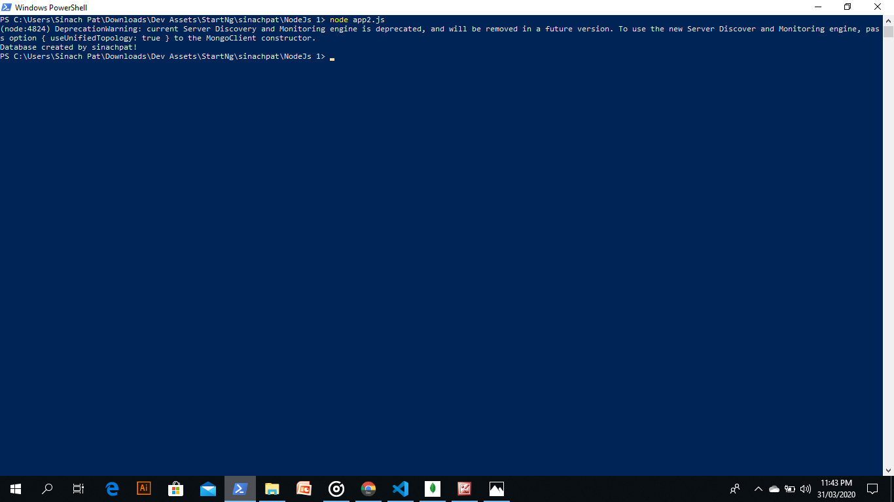
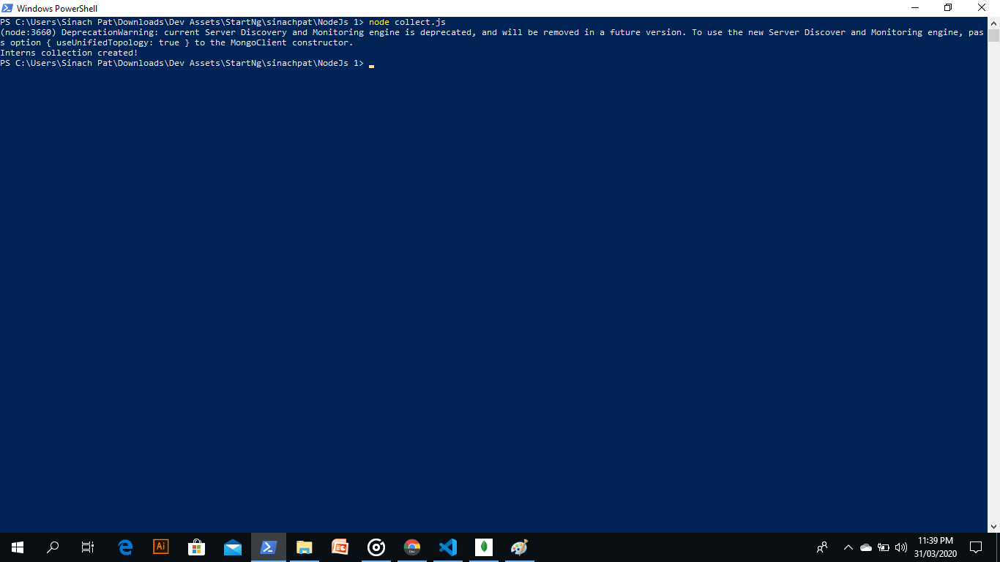

# NodeJs2
This is the second nodejs task in the StartNg software development training.

## First Image for Database creation and connection

## Second Image for collection creation

### Goodluck to Myself
